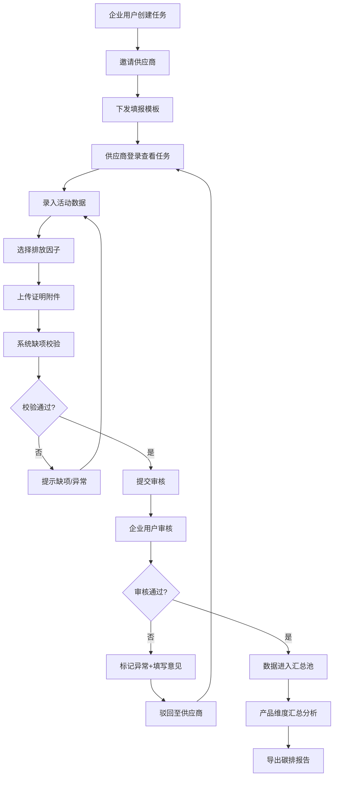

## 1. 产品概述

碳中和供应商协同平台是一款面向制造企业的 SaaS 应用，用于向上游供应商收集产品相关碳排放资料，实现供应链碳数据的规范化采集、审核、汇总与报告导出。核心解决企业在碳盘查过程中数据分散、标准不一、追溯困难等痛点。

- 目标用户：制造企业 ESG/碳管理团队、上游供应商环保/技术负责人
- 市场价值：助力企业实现供应链碳中和目标，满足合规要求，提升绿色竞争力

## 2. 核心功能

### 2.1 用户角色

| 角色 | 登录方式 | 核心权限 |
|------|----------|----------|
| 企业用户 | 企业账号登录 | 供应商邀请、模板下发、审核数据、产品汇总、批量催办、导出报告 |
| 供应商用户 | 邮箱邀请链接登录 | 查看任务、填报数据、上传附件、回复意见、查看反馈 |

### 2.2 功能模块

1. **供应商工作台**：任务概览、进度统计、待办提醒、任务列表
2. **资料填报页**：活动数据录入、排放因子选择、附件上传、缺项校验、版本留痕、保存/提交
3. **审核页**：数据审查、异常值标记、审核意见、通过/驳回、版本对比
4. **产品汇总页**：产品维度碳排放汇总、物料/供应商筛选、图表可视化、导出报告
5. **提醒中心**：消息通知、批量催办、催办记录、反馈追踪

### 2.3 页面详情

| 页面名称 | 模块名称 | 功能描述 |
|----------|----------|----------|
| 供应商工作台 | 数据概览卡片 | 显示待填报、审核中、已通过、已驳回数量统计 |
| 供应商工作台 | 任务进度统计 | 按状态分布的环形图 + 完成率百分比 |
| 供应商工作台 | 任务列表 | 产品名称、物料编码、截止日期、状态标签、操作按钮 |
| 资料填报页 | 填报模板区 | 分阶段展示：原材料获取、生产制造、运输配送 |
| 资料填报页 | 活动数据录入 | 能源消耗、物料用量、运输距离等数值输入 + 单位选择 |
| 资料填报页 | 排放因子选择 | 因子库搜索、分类筛选、自动匹配推荐、数值展示 |
| 资料填报页 | 附件上传 | 拖拽上传、多文件、格式校验、预览/删除 |
| 资料填报页 | 缺项校验 | 必填项检查、异常值提示、校验结果汇总 |
| 资料填报页 | 版本留痕 | 历史版本列表、版本对比、恢复历史版本 |
| 审核页 | 数据审查 | 填报数据逐项展示、计算公式展示、排放结果 |
| 审核页 | 异常值标记 | 偏离阈值高亮、标记原因输入、批量标记 |
| 审核页 | 审核意见 | 意见输入框、引用数据行、提交/保存草稿 |
| 审核页 | 审核操作 | 通过、驳回（附原因）、版本对比视图 |
| 产品汇总页 | 汇总筛选 | 按产品、物料、供应商、时间范围多维筛选 |
| 产品汇总页 | 碳排放图表 | 各阶段排放量堆叠柱状图、供应商对比雷达图 |
| 产品汇总页 | 数据表格 | 产品/物料维度详细数据、异常值标记、钻取详情 |
| 产品汇总页 | 导出报告 | PDF/Excel 导出、自定义报告模板 |
| 提醒中心 | 消息列表 | 系统通知、审核反馈、催办消息、已读/未读状态 |
| 提醒中心 | 批量催办 | 多选任务、催办模板、自定义催办语、发送记录 |

## 3. 核心流程

### 3.1 主业务流程描述

企业用户创建产品碳排放收集任务，邀请供应商并下发填报模板；供应商登录后查看任务，按模板录入活动数据、选择排放因子、上传证明附件，系统进行缺项校验后提交；企业用户审核数据，标记异常值并给出审核意见，通过或驳回；供应商根据意见修改后重新提交；审核通过后，数据进入产品汇总池，支持多维度分析和报告导出。

### 3.2 Mermaid 流程图

## 4. 用户界面设计

### 4.1 设计风格

- **主色调**：深森林绿 `#1B4332`（代表自然与环保），搭配翠绿 `#40916C` 作为强调色
- **辅助色**：暖橙色 `#F4A261` 用于警告/待办，深青色 `#264653` 用于中性信息
- **背景色**：米白 `#FEFAE0` 为底色，卡片使用纯白 `#FFFFFF`
- **按钮风格**：圆角 8px，主按钮深绿渐变，次按钮描边深绿
- **字体**：标题使用「思源黑体 Bold」，正文使用「思源宋体 Regular」，数据表格使用等宽字体「JetBrains Mono」
- **布局风格**：左侧导航栏 + 顶部面包屑 + 右侧内容区，卡片式分组，充足留白
- **图标风格**：Lucide 线性图标，统一 1px 描边，配色与主题呼应
- **质感细节**：卡片阴影 `0 2px 8px rgba(27, 67, 50, 0.08)`，表格斑马纹，微交互动效

### 4.2 页面设计概览

| 页面名称 | 模块名称 | UI 元素 |
|----------|----------|---------|
| 供应商工作台 | 数据概览 | 4 张渐变卡片（深绿/翠绿/橙色/青色）+ 数据数字动画 |
| 供应商工作台 | 进度统计 | 环形进度图（SVG 实现）+ 图例说明 |
| 供应商工作台 | 任务列表 | 表格 + 状态标签（带色点）+ 操作按钮组 |
| 资料填报页 | 模板分区 | 折叠面板 + 步骤进度条 + 分区标题 |
| 资料填报页 | 数据录入 | 数值输入框（带单位下拉）+ 自动计算预览 |
| 资料填报页 | 因子选择 | 搜索框 + 分类标签 + 因子卡片（带推荐标识） |
| 资料填报页 | 附件上传 | 拖拽区（虚线边框）+ 文件列表（带缩略图/图标） |
| 资料填报页 | 校验提示 | 顶部警告条 + 字段级红框标注 + 缺项列表 |
| 审核页 | 数据对比 | 左右分栏版本对比 + 差异高亮 |
| 审核页 | 异常标记 | 行级高亮（浅橙底）+ 标记图标 + 悬浮原因气泡 |
| 产品汇总页 | 图表区 | ECharts 堆叠柱图 + 雷达图 + 卡片容器 |
| 产品汇总页 | 汇总表 | 固定表头 + 斑马纹 + 异常值红圆点标记 |
| 提醒中心 | 消息列表 | 左侧图标 + 标题摘要 + 时间 + 未读红点 |
| 提醒中心 | 批量催办 | 多选复选框 + 模板下拉 + 文本域 + 发送按钮 |

### 4.3 响应式

- 桌面端优先（1440px 基准），适配 1024px 以上屏幕
- 平板端：左侧导航折叠为图标模式，表格支持横向滚动
- 移动端：顶部汉堡菜单，卡片单列布局，表格转为卡片列表展示
- 触摸优化：按钮最小 44px 高度，表单元素触摸区域充足

### 4.4 数据可视化

- 图表库：ECharts，使用自定义主题匹配整体深绿配色
- 动画效果：数据加载时数值递增动画，图表渐入效果
- 交互：支持图表数据筛选、钻取、悬浮提示框
