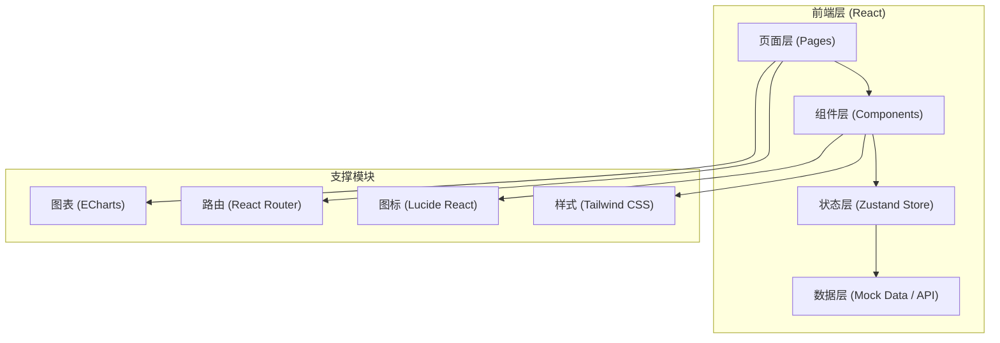
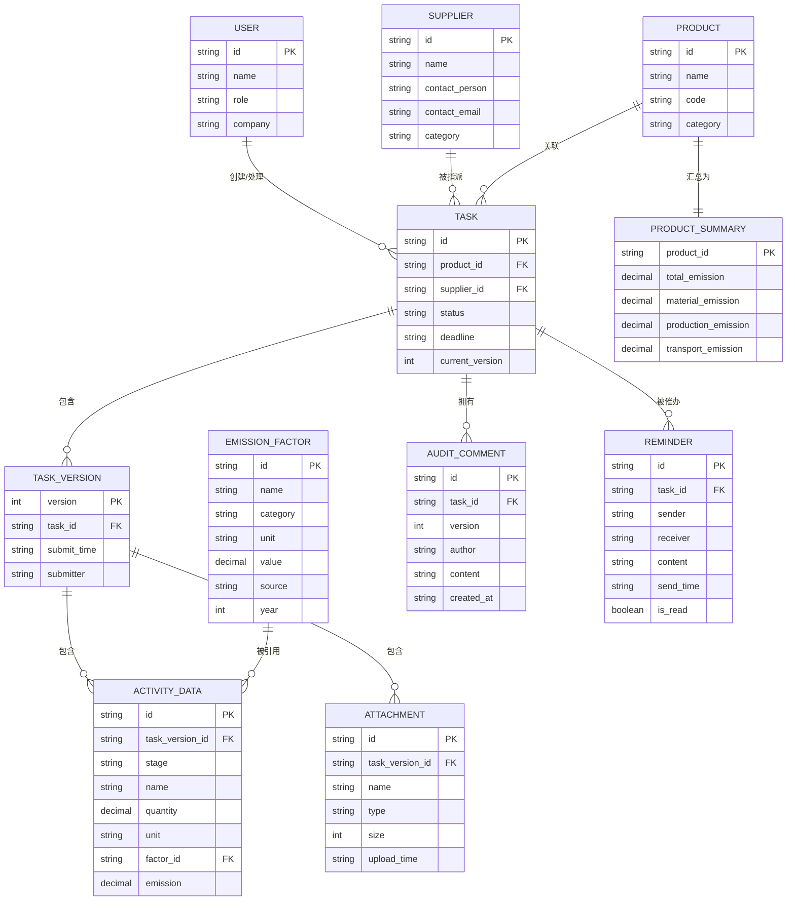

## 1. 架构设计



## 2. 技术描述

- **前端框架**：React 18 + TypeScript 5
- **构建工具**：Vite 5
- **样式方案**：Tailwind CSS 3 + CSS 变量主题系统
- **状态管理**：Zustand（轻量级，适合中后台场景）
- **路由**：React Router DOM 6
- **图表库**：ECharts 5 + echarts-for-react
- **图标库**：Lucide React
- **后端**：无后端，使用 TypeScript Mock 数据模拟服务层
- **数据持久化**：LocalStorage（用于保存填报草稿和用户偏好）

## 3. 路由定义

| 路由 | 用途 |
|------|------|
| `/` | 登录角色选择页（企业/供应商视角切换） |
| `/dashboard` | 供应商工作台首页 |
| `/report/:taskId` | 资料填报页 |
| `/audit/:taskId` | 审核页（企业用户视角） |
| `/summary` | 产品汇总页 |
| `/notifications` | 提醒中心 |

## 4. 数据模型

### 4.1 核心类型定义

```typescript
// 用户角色
type UserRole = 'enterprise' | 'supplier';

// 任务状态
type TaskStatus = 'pending' | 'draft' | 'submitted' | 'auditing' | 'approved' | 'rejected';

// 用户信息
interface User {
  id: string;
  name: string;
  role: UserRole;
  company: string;
  avatar?: string;
}

// 供应商
interface Supplier {
  id: string;
  name: string;
  contactPerson: string;
  contactEmail: string;
  category: string;
}

// 产品
interface Product {
  id: string;
  name: string;
  code: string;
  category: string;
}

// 排放因子
interface EmissionFactor {
  id: string;
  name: string;
  category: string;
  unit: string;
  value: number;
  source: string;
  year: number;
  isRecommended?: boolean;
}

// 活动数据项
interface ActivityData {
  id: string;
  stage: 'material' | 'production' | 'transport';
  name: string;
  description?: string;
  quantity: number | null;
  unit: string;
  factorId: string | null;
  emission: number | null;
  remark?: string;
}

// 附件
interface Attachment {
  id: string;
  name: string;
  type: string;
  size: number;
  uploadTime: string;
  url?: string;
}

// 任务版本
interface TaskVersion {
  version: number;
  submitTime: string;
  submitter: string;
  comment?: string;
  data: ActivityData[];
  attachments: Attachment[];
}

// 审核意见
interface AuditComment {
  id: string;
  taskId: string;
  version: number;
  author: string;
  authorRole: UserRole;
  content: string;
  createdAt: string;
  references?: string[]; // 关联的数据项ID
}

// 任务
interface Task {
  id: string;
  productId: string;
  productName: string;
  productCode: string;
  supplierId: string;
  supplierName: string;
  templateId: string;
  status: TaskStatus;
  deadline: string;
  createdAt: string;
  updatedAt: string;
  currentVersion: number;
  versions: TaskVersion[];
  comments: AuditComment[];
  anomalies: string[]; // 异常数据项ID
}

// 催办记录
interface Reminder {
  id: string;
  taskId: string;
  sender: string;
  receiver: string;
  content: string;
  sendTime: string;
  isRead: boolean;
}

// 产品汇总
interface ProductSummary {
  productId: string;
  productName: string;
  productCode: string;
  totalEmission: number;
  materialEmission: number;
  productionEmission: number;
  transportEmission: number;
  supplierBreakdown: { supplierId: string; supplierName: string; emission: number }[];
  lastUpdated: string;
}
```

### 4.2 Mermaid ER 图



## 5. 目录结构

```
src/
├── components/           # 通用组件
│   ├── layout/          # 布局组件（Sidebar、Header、Layout）
│   ├── common/          # 通用 UI（Button、Card、Modal、Tag、Table）
│   └── business/        # 业务组件（TaskCard、DataForm、FactorSelector...）
├── pages/               # 页面
│   ├── RoleSelect.tsx
│   ├── Dashboard.tsx
│   ├── ReportForm.tsx
│   ├── AuditPage.tsx
│   ├── SummaryPage.tsx
│   └── Notifications.tsx
├── store/               # Zustand 状态
│   ├── useUserStore.ts
│   ├── useTaskStore.ts
│   └── useUINotificationStore.ts
├── data/                # Mock 数据
│   ├── mockTasks.ts
│   ├── mockFactors.ts
│   ├── mockSuppliers.ts
│   └── mockProducts.ts
├── types/               # TypeScript 类型
│   └── index.ts
├── utils/               # 工具函数
│   ├── emission.ts      # 碳排放计算
│   ├── validation.ts    # 校验工具
│   └── format.ts        # 格式化工具
├── hooks/               # 自定义 Hooks
│   ├── useTaskValidation.ts
│   └── useExport.ts
├── App.tsx
├── main.tsx
└── index.css
```
